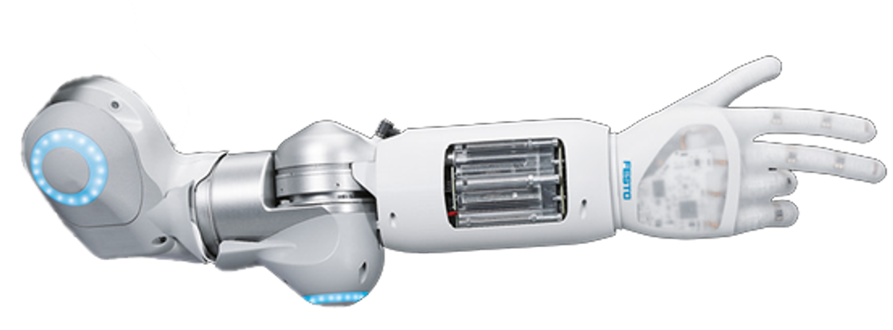

# PHAND ROS PROJECT
[](https://www.festo.com/group/de/cms/10156.htm)
The pHand ROS project provides the implementation to control the BionicSoftHand with ROS.

## IMPORTANT

The maximum supply pressure for the BionicSoftHand is 3 bars. If you connect more than this amount of air pressure the hand gets damaged and is not usable anymore.

## PROLOG
The BionicSoftHand is a pneumatic gripper with 12 independent controllable chambers.

## REQUIREMENTS
To be able to launch the pHand package Python3 and Ros has to be installed. 
Because ROS is not working directly with Python3 the following code lines have to be executed:
```
sudo apt-get install python3-pip python3-yaml
sudo pip3 install rospkg catkin_pkg
```

The ROS package uses the bionic_python_libs which provide the core functionality to communicate with the BionicSoftHand. These packages have to be installed on your system. This is done with executing the script `install_linux.bash` inside the bionic_python_libs repository which installs the libraries.

## START
To start the ROS package source it and execute the launch file.
```
TODO: Launch file
```

## PROVIDED FUNCTIONS

There is one main topic to get the default data provided by the BionicSoftHand:
```
festo/phand/state
```
Each connected "external" sensor is published on its own topic:
```
festo/phand/connected_sensors/%sensor_name%
```
To set the valves publish the corresponding `ValveSetPoints` message to the topic.
```
festo/phand/set_valve_setpoints
```