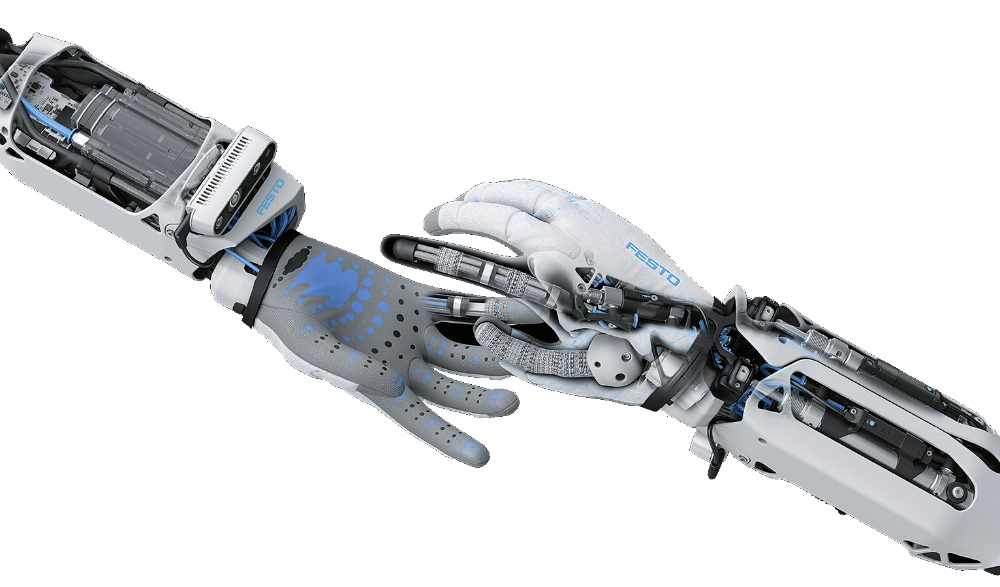

[](https://www.festo.com/group/de/cms/10156.htm)

> <p style="font-size:30px">BionicSoftHand ROS Libraries </p>
> The BionicSoftHand is a pneumatic gripper with 12 independent controllable chambers. 

<br></br>

# LICENSE
The Festo BionicSoftHand ROS libraries are published under the [GNU GPL v3.0 License](https://www.gnu.org/licenses/gpl-3.0.de.html).

# PURPOSE
These libraries use the bionic python libraries as the core and provide the ROS functionalities on top. It provides services and topics to interact with the BionicSoftHand.

# IMPORTANT
The maximum supply pressure for the BionicSoftHand is **5 bars**. If you connect more than this amount of air pressure the hand gets damaged and is not usable anymore.

Up to 300V is used for the piezo valves. Be careful with the back part of the valve terminal and avoid touching it.

# INSTALL INSTRUCTIONS

## HELPER SCRIPTS
There are some helper scripts [here](https://github.com/Schwimo/linux_config) to setup your environment.

## MANUAL INSTALL
The ROS package uses the bionic_python_libs which provide the core functionality to communicate with the BionicSoftHand. 
These packages have to be installed on your system. 

* Download or clone the necessary repositories
    * [PID Control](https://github.com/Schwimo/bionic-pid-control)
    * [DHCP](https://github.com/Schwimo/bionic-dhcp)
    * [Bionic Message Tools](https://github.com/Schwimo/bionic-message-tools)
    * [BionicSoftHand Python Libraries](https://github.com/Schwimo/phand-python-libs)
* And install one by one on your computer. To do this change into the root directory of each cloned repository and enter the following command. This executes the `setup.py` file and installes the libraries locally on your computer. The point in the end means to use the current directory.
    * `` pip3 install .  ``
* The bionic_python_libs libraries require python3. The default python for ROS up to melodic is python2. To make ROS work with python3 you have to install the following packages: 
    * `` sudo apt-get install python3-pip python3-yaml python-catkin-tools python3-dev python3-numpy ``
    * `` sudo pip3 install rospkg catkin_pkg ``
* Create a new ROS workspace (http://wiki.ros.org/catkin/Tutorials/create_a_workspace)
* Clone this repository into the **src** folder of the created workspace
* Build the workspace

**Linux**:
If you also need to setup a ROS environment, look into [this repository](https://github.com/Schwimo/linux_config) for installation scripts. If you just want to install the ROS workspace for the BionicSoftHand, execute the following line from a terminal:
```bash
bash <(wget -qO- https://raw.githubusercontent.com/Schwimo/linux_config/master/scripts/setup_phand.bash)
```

# BIONIC SOFT HAND 2.0 SETUP
[](https://www.festo.com/group/de/cms/10156.htm)
Checkout the [phand-python-libs](https://github.com/Schwimo/phand-python-libs) readme to see how the hardware is working.

# ROS USAGE
When the catkin build completed withour errors, the next steps show the usage.

## Launchfiles
To start the hardware interface execute the launch file.
```
roslaunch festo_phand_driver hardware_interface.launch
```

## Debug User Interface
There is a debug user interface available which is automatically launched when you start the hardware_interface.launch file.
To open it, start a browser of your choice and type in the IP-Address of this ROS machine with the port 7954. 
```
localhost:7954
```

## ROS topics
**The hand publishes the following topics:**
```
festo/phand/state
```
With the current state of the hand and internal sensors

Each connected "external" sensor is published on its own topic:
```
festo/phand/connected_sensors/%sensor_name%
```

**The hand subscribes to the following topic:**

In the default setup the hand is in the pressure control mode. To move the fingers, send a message to this topic.
```
festo/phand/set_pressures
```
To set the pressures in the fingers or the wrist publish the corresponding `SimpleFluidPressures` message to the topic.
The pressure should be between 100000 (PSI) and 600000 (PSI).

```
festo/phand/set_valve_setpoints
```
To set the valves publish the corresponding `ValveSetPoints` message to the topic.
The values should be between 0.0 and 1.0. 0 Meaning 0V for the piezo valve and 1.0 meaning 300V for the piezo valve.

## ROS services
The following services are offered by the hardware interface:

```
/festo/phand/close
```
To close the hand 
```
/festo/phand/open
```
To open the hand
```
/festo/phand/set_configuration
```
To change the configuration of the hand
